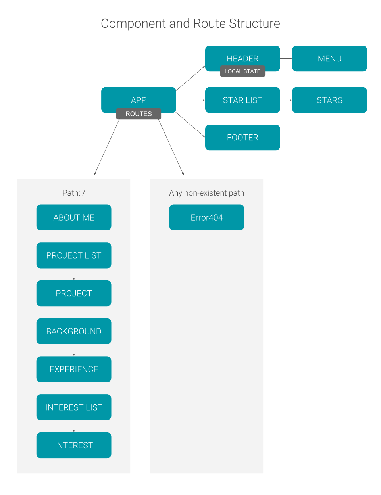

# Portfolio

#### Portfolio of my work built in React, 2.15.19

#### By Kristin Brewer-Lowe

## Description

This site is a portfolio of my work and includes sample work, my background, work experience, skills and interests. I originally built this site with a basic .html and .css file, and I've completely rebuilt it using React. 

## Site Plan

## Setup/Installation Requirements

* Clone this project with `git clone https://github.com/klowe27/portfolio-react`
* Run `npm install` to install dependencies
* Run `npm run start` to build and serve the project
* View the project in any browser at `http://localhost:8080/`

## Known Bugs

There are no known bugs at this time.

## Support and contact details

If you discover a bug or would like to make a suggestion, email me at kristin.lowe1@gmail.com.

## Technologies Used

React, Materialize, Webpack.

### License

This software is licensed under the MIT license.

Copyright (c) 2019 **Kristin Brewer-Lowe**
